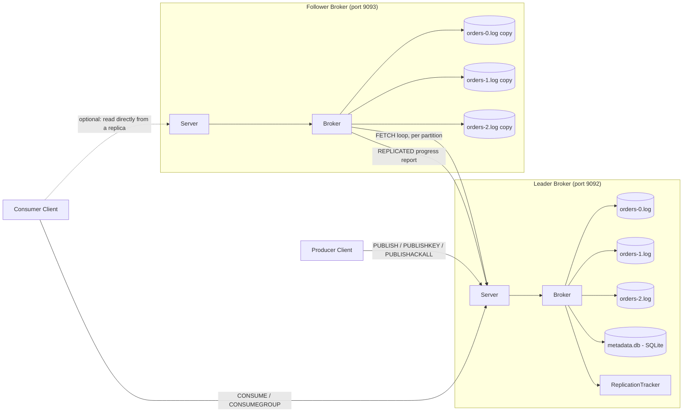
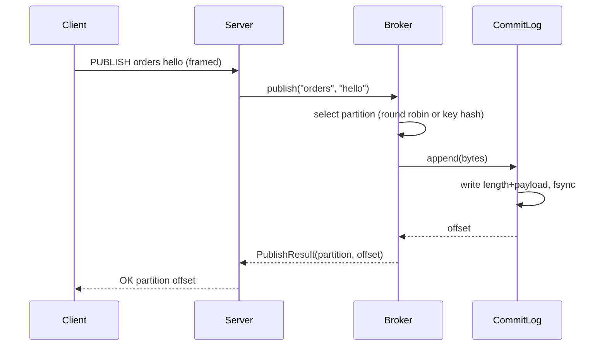
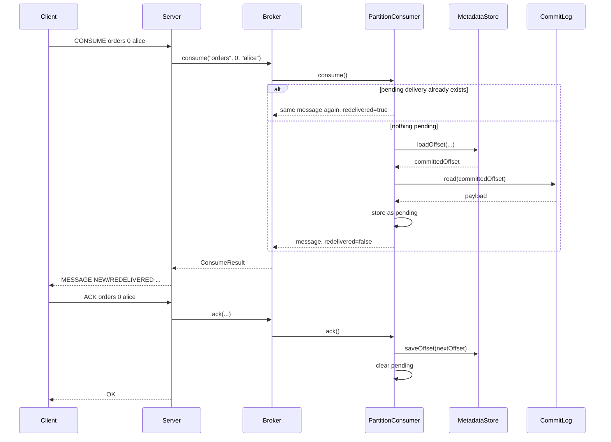
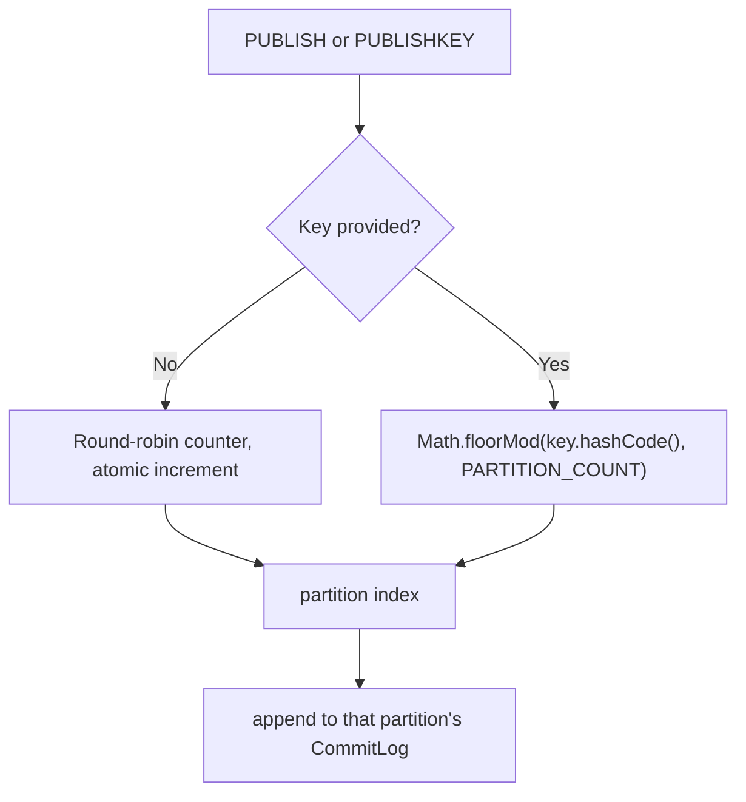
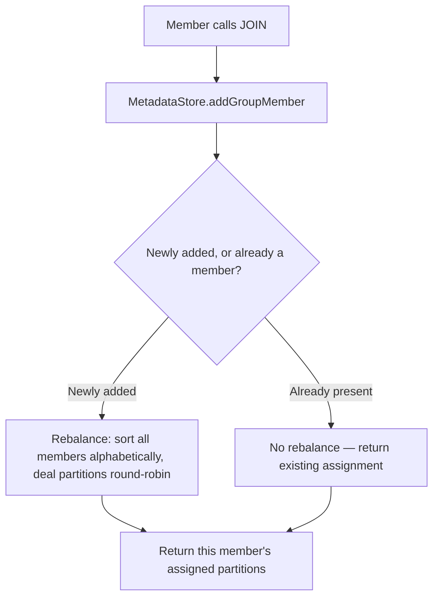
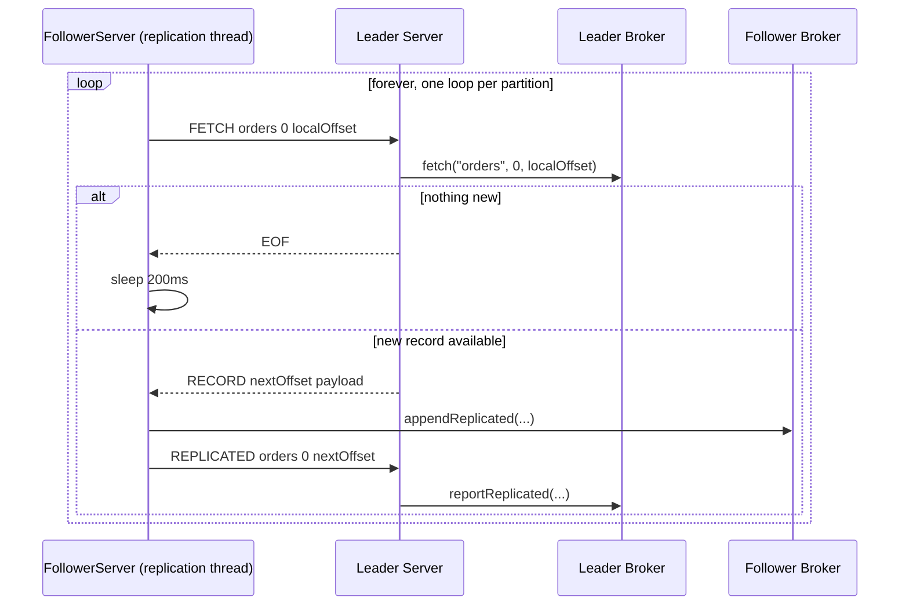

# Camus

A from-scratch Apache Kafka-style distributed log, built in plain Java (no external messaging frameworks) to learn exactly how a system like Kafka works internally — networking, storage, concurrency, partitioning, consumer groups, replication — by building each piece by hand, phase by phase.

> **Status:** educational project, phases 0–9 complete. Not production-ready — see [Known Limitations](#known-limitations).

## Quick Start

1. Open this folder in IntelliJ/VS Code as a Gradle project (Java 21 toolchain required).
2. Run `Server.java` — this is the leader broker, listening on port 9092.
3. (Optional) Run `FollowerServer.java` — a replica broker on port 9093, mirroring the topic `orders`.
4. Run `Client.java` for an interactive session, or one of the test/demo classes (`ConcurrencyTest`, `NetworkRaceTest`, `LockDemo`, `BrokerLockCheck`) to exercise specific behaviors.
5. Try: `PUBLISHKEY orders ride-456 picked-up`, then `CONSUMEKEY orders ride-456 alice`, then `ACKKEY orders ride-456 alice`.

All runtime data lives under `data/` (leader) and `data-follower/` (follower) — delete these folders to reset to a clean slate.

---

## High-Level Design

The system is one Java process per broker. A producer or consumer is just a TCP client speaking a small text-over-binary-frames protocol. A topic is split into independent partitions, each an append-only log file; a leader broker owns all writes, and an optional follower broker mirrors the data by continuously pulling from the leader.



### Design principles this system follows throughout

- **Append-only log as the core primitive.** Every partition is just sequential, immutable bytes on disk — fast to write, trivially safe to read concurrently, and the foundation everything else (offsets, replication, replay) is built on.
- **Pull-based consumption.** Consumers (and followers, which are really just a special kind of consumer) always ask the broker for data; the broker never pushes. This gives natural backpressure and is exactly how real Kafka works.
- **At-least-once delivery.** A message is only considered "done" when explicitly acknowledged. Until then, it's redelivered on every request — never silently skipped, occasionally reprocessed.
- **One lock per shared resource, not one lock for everything.** Each `CommitLog` (per partition), `PartitionConsumer` (per partition+consumer), `ConsumerGroup` (per topic+group), and `MetadataStore` (per database connection) owns its own lock. Nothing in `Broker` itself needs a shared lock — it only does safe lookups via `ConcurrentHashMap`.
- **Metadata and message data are stored differently, on purpose.** Messages live in plain append-only files (`CommitLog`); small, frequently-changing, relationally-shaped state (offsets, group membership) lives in a real embedded database (`MetadataStore`, SQLite via JDBC) — the right tool for each shape of data.

---

## Low-Level Design

### Component responsibilities

| Class | Responsibility | Locking |
|---|---|---|
| `Server` | Accepts TCP connections, frames/unframes wire messages, parses and dispatches commands | None directly — delegates to `Broker` |
| `FollowerServer` | Runs a normal `Server` *and* a background replication thread per partition | None directly |
| `Client` | Interactive test client: sends typed commands, prints responses | N/A |
| `Framing` | Length-prefixed binary read/write over a socket | N/A (stateless static helpers) |
| `Broker` | Owns and looks up all `CommitLog`/`PartitionConsumer`/`ConsumerGroup` instances; partition selection (round-robin or key hash); replication coordination | None — relies on `ConcurrentHashMap` + per-object locks below |
| `CommitLog` | One partition's append-only file: `append`, `read`, `endOffset` | `synchronized` per instance (i.e., per partition) |
| `PartitionConsumer` | One (topic, partition, consumer) triple's read position: pending-delivery tracking + commit | `synchronized` per instance |
| `ConsumerGroup` | One (topic, group) pair's membership + partition assignment (round-robin over sorted members) | `synchronized` per instance |
| `MetadataStore` | SQLite-backed durable storage for consumer offsets and group membership | `synchronized` per instance (one shared connection) |
| `ReplicationTracker` | Tracks the highest offset each partition has been confirmed replicated to, for `PUBLISHACKALL` | `ConcurrentHashMap`, lock-free |

### Wire protocol — command reference

Every command is one line of text (`COMMAND arg1 arg2 ...`), sent and received as a length-prefixed binary frame (see `Framing.java`), not newline-delimited.

| Command | Arguments | Response | Notes |
|---|---|---|---|
| `PING` | — | `PONG` | connectivity check |
| `PUBLISH` | `topic message` | `OK partition offset` | round-robin partition selection |
| `PUBLISHKEY` | `topic key message` | `OK partition offset` | sticky: same key always → same partition |
| `PUBLISHACKALL` | `topic message` | `OK partition offset` or `ERROR: timed out...` | blocks until a follower confirms (acks=all) |
| `PARTITIONFOR` | `topic key` | `PARTITION n` | preview where a key would land |
| `CONSUME` | `topic partition consumerName` | `MESSAGE NEW\|REDELIVERED text` or `EOF` | explicit partition |
| `ACK` | `topic partition consumerName` | `OK` or `ERROR: nothing to acknowledge` | commits the last delivered message |
| `CONSUMEKEY` | `topic key consumerName` | same as `CONSUME` | partition computed automatically from key |
| `ACKKEY` | `topic key consumerName` | same as `ACK` | partition computed automatically from key |
| `JOIN` | `topic groupName memberId` | `ASSIGNED p1,p2,...` or `ASSIGNED NONE` | joins (or rejoins) a consumer group, triggers rebalance |
| `LEAVE` | `topic groupName memberId` | `OK` | leaves a group, triggers rebalance |
| `ASSIGNMENT` | `topic groupName memberId` | `ASSIGNED ...` | query current assignment without changing membership |
| `CONSUMEGROUP` | `topic groupName memberId` | `MESSAGE partition NEW\|REDELIVERED text` or `EOF` | reads from whichever owned partition has data |
| `FETCH` | `topic partition offset` | `RECORD nextOffset payload` or `EOF` | raw read by exact offset, no consumer bookkeeping — used for replication |
| `REPLICATED` | `topic partition offset` | `OK` | a follower reporting its replication progress |
| `QUIT` | — | `BYE` | closes the connection |

### On-disk layout

```
data/                          (leader)
├── orders-0.log                partition 0's append-only log
├── orders-1.log
├── orders-2.log
└── metadata.db                 SQLite: consumer_offsets, group_members tables
    metadata.db-wal              (WAL mode working files — normal, not corruption)
    metadata.db-shm

data-follower/                 (follower, mirrors only the configured topic)
├── orders-0.log
├── orders-1.log
├── orders-2.log
└── metadata.db
```

### Record format inside a `.log` file

```
[4 bytes: payload length, big-endian int] [payload bytes (UTF-8 text)]
```

repeated end to end. An "offset" is the literal byte position where a record's length-prefix begins.

---

## Flow Diagrams

### Publish



### Consume + Ack (at-least-once)



### Partition selection



### Consumer group join / rebalance



### Replication (follower pulling from leader)



---

## Project Structure

```
kafka-clone-java/
├── build.gradle
├── settings.gradle
├── README.md
└── src/main/java/com/kafkaclone/
    ├── Server.java              leader broker entry point + command dispatch
    ├── FollowerServer.java      replica broker entry point + replication threads
    ├── Client.java              interactive test client
    ├── Framing.java             length-prefixed binary read/write
    ├── Broker.java              ties topics, partitions, consumers, groups, replication together
    ├── CommitLog.java           one partition's append-only log file
    ├── PartitionConsumer.java   one (partition, consumer)'s read position + at-least-once logic
    ├── ConsumerGroup.java       one (topic, group)'s membership + partition assignment
    ├── MetadataStore.java       SQLite-backed offsets and group membership
    ├── ReplicationTracker.java  tracks follower replication progress for acks=all
    ├── ConcurrencyTest.java     stress test: many concurrent publishers, verifies no data loss
    ├── NetworkRaceTest.java     two real clients racing to publish at once
    ├── LockDemo.java            minimal standalone demo of what `synchronized` does
    └── BrokerLockCheck.java     same race-condition demo, against the real Broker
```
## Known Limitations

This project is for learning, not production use. Specifically, and non-exhaustively:

- **No security at all** — no authentication, authorization, or encryption. Anyone reaching the port can do anything.
- **No real consensus or automatic failover.** Replication is a simple leader/follower mirror; promoting a follower is a manual decision, not an automatic election (no Raft/ZooKeeper-style coordination).
- **One global partition count** for every topic, hardcoded, not configurable per topic.
- **No enforcement of consumer-group partition ownership** — a client could call `CONSUME` on a partition it wasn't actually assigned, and nothing stops it.
- **No batching, compression, or zero-copy transfer** — every record is fsynced individually; throughput is far below real Kafka's.
- **No automatic group-membership failure detection** — a member that vanishes without calling `LEAVE` is assumed to still be alive forever.
- **Zero production track record.** Real Kafka has over a decade of battle-testing across production systems; this has existed for one project.

For an actual distributed-systems project, use real Apache Kafka or a comparable production-grade system (Redpanda, Pulsar, RabbitMQ, NATS) — the concepts learned here transfer directly to using and reasoning about those systems well.
